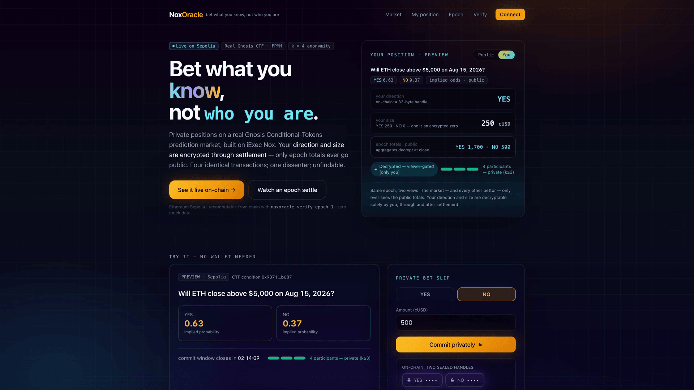
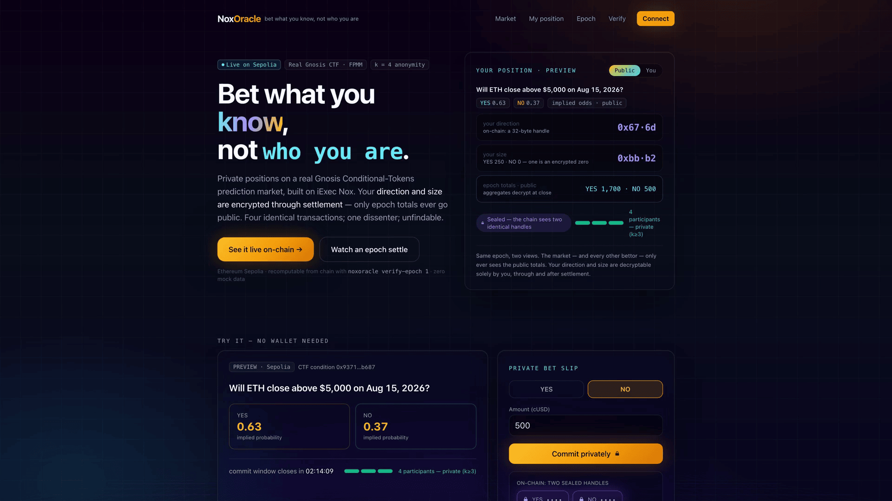
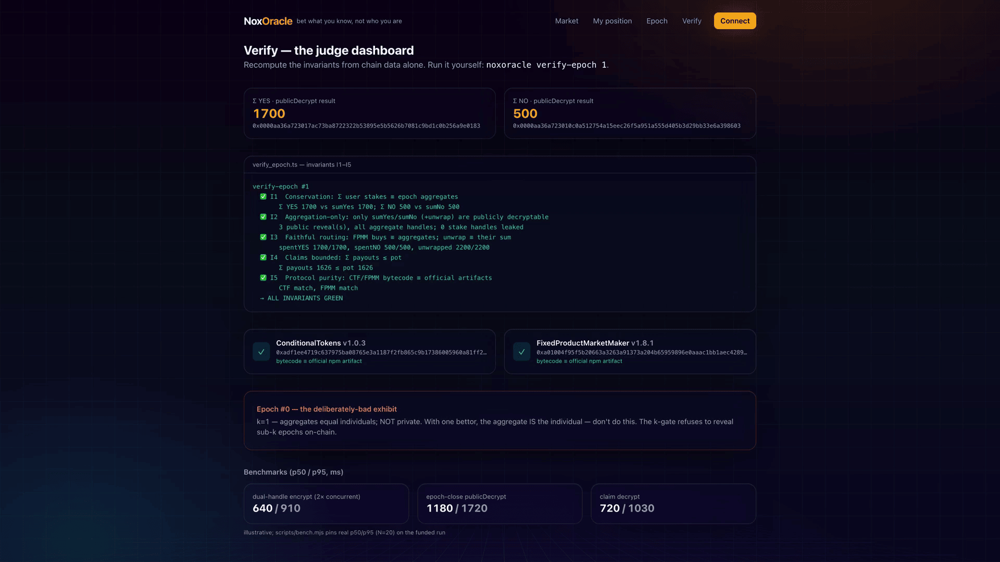

<div align="center">
  
  <h1>NoxOracle 🔮</h1>
  <p><em>Bet what you know, not who you are.</em></p>
  

  <br/>

  [](https://youtu.be/eVRYuVqWf_k)
  [](https://noxoracle.edycu.dev)
  [](https://noxoracle.edycu.dev/pitch)
  [](https://dorahacks.io/hackathon/wtf-hackathon)
  [](https://dorahacks.io/buidl/47256)
  [](https://sepolia.etherscan.io/address/0xfFba9520699EC4161f41F9bD220e6ce7083d4a2E)

  <br/>

  [](https://nextjs.org)
  [](https://www.typescriptlang.org)
  [](https://sepolia.etherscan.io)
  [](https://github.com/gnosis/conditional-tokens-contracts)
  [](https://eips.ethereum.org/EIPS/eip-7984)
  [](https://github.com/edycutjong/noxoracle/actions/workflows/ci.yml)
  [](https://github.com/edycutjong/noxoracle/actions/workflows/ci.yml)
  [](https://opensource.org/licenses/MIT)
  [](https://github.com/edycutjong/noxoracle/actions/workflows/ci.yml)

  <br/>

  <p><em>✅ Live on Ethereum Sepolia — the full confidential cycle (commit-private → public-aggregate → claim-private) proven on-chain over a byte-for-byte unmodified Gnosis CTF market. 197 tests green.</em></p>

</div>

<div align="center">
  
  <p><sub>The live app at <a href="https://noxoracle.edycu.dev">noxoracle.edycu.dev</a> — commit a private bet; only epoch totals ever go public.</sub></p>
</div>

<div align="center">
<table>
<tr>
<td width="50%"><br><sub>Try it, no wallet — a bet becomes two sealed handles, one an encrypted zero.</sub></td>
<td width="50%"><br><sub><code>/verify</code> — <code>verify-epoch</code> recomputes every invariant from chain data.</sub></td>
</tr>
</table>
</div>

---

> **4 identical transactions. One dissenter. Unfindable.**

**The problem.** Prediction markets price truth — but only if informed people dare to bet. On-chain
markets (Polymarket-style, on Gnosis Conditional Tokens) expose every position: direction, size,
timing, wallet. Anyone with reputational, employment, or political exposure self-censors, and the
market loses exactly the information it exists to collect.

**The approach.** NoxOracle keeps the **real market untouched** — the official Gnosis CTF +
FixedProductMarketMaker, deployed byte-for-byte from the npm artifacts and **CI hash-checked** — and
adds a confidential participation layer. A bet is committed as **two encrypted amounts** (YES-stake,
NO-stake; one is an encrypted zero) so direction never exists in plaintext. Stakes pool in
confidential cUSD; at epoch close only the **aggregates** are publicly decrypted and routed through
the FPMM in one batch; winners are paid in confidential cUSD at a public pot/pool rate. Individual
direction and size stay hidden **through and after settlement**.

**One flow, with depth:** `commit-private → batch-execute-public-aggregate → claim-private` on one
real market — with an in-product k-anonymity meter and an independently-recomputable `verify-epoch`.

## 🟢 Status (this build)

- ✅ **197 tests green, locally** — 134 pure-logic (`@noxoracle/confidential-ctf`, vitest) + 63 Solidity
  (Hardhat), incl. the **entire** confidential cycle (commit → close → execute → finalize → settle →
  claim) against the **real** cUSD wrapper + **real** Gnosis CTF/FPMM on a transparent local Nox mock.
- ✅ **Novel contract compiles** (`NoxOraclePool.sol`, solc 0.8.35) and passes I1–I5.
- ✅ **CTF/FPMM deploy-of-record + bytecode hash-check** proven locally AND **on live Sepolia** (I5:
  CTF MATCH, FPMM master MATCH).
- ✅ **Live on Ethereum Sepolia** — deployed + the FULL confidential cycle run end-to-end on-chain
  (4 private commits **k=4** → aggregates **YES 1,700 / NO 500** → real FPMM buys → NO resolves →
  Dana's sealed claim paid **exactly the pot, 1,626.1277 cUSD** = encrypted stake × public rate).
  **`verify-epoch 1` recomputes I1–I5 GREEN from chain data; `check-artifacts` confirms CTF + FPMM
  bytecode ≡ official artifacts. NoxOraclePool is [source-verified on
  Etherscan](https://sepolia.etherscan.io/address/0xfFba9520699EC4161f41F9bD220e6ce7083d4a2E#code)
  (solc 0.8.35) — read the actual contract, don't take our word for it.**
  | Contract | Address |
  |---|---|
  | NoxOraclePool (novel, source-verified ✓) | [`0xfFba9520699EC4161f41F9bD220e6ce7083d4a2E`](https://sepolia.etherscan.io/address/0xfFba9520699EC4161f41F9bD220e6ce7083d4a2E#code) |
  | ConditionalTokens 1.0.3 (unmodified, hash ✓) | [`0xCd316D0655989fBcedb818b59B7374f62eA734a5`](https://sepolia.etherscan.io/address/0xCd316D0655989fBcedb818b59B7374f62eA734a5) |
  | FPMM 1.8.1 instance (unmodified) | [`0xBf4900df1Da779836DFC03a746307fAFBEEf4cc3`](https://sepolia.etherscan.io/address/0xBf4900df1Da779836DFC03a746307fAFBEEf4cc3) |
  | FPMM Factory 1.8.1 (hash ✓) | [`0x5c496C1CD31bdfcaD8278E2Af8dE93a6f3Fa7359`](https://sepolia.etherscan.io/address/0x5c496C1CD31bdfcaD8278E2Af8dE93a6f3Fa7359) |
  | cUSD wrapper (reused) | [`0x82C281D7403e44d61968c2F49751a56877468991`](https://sepolia.etherscan.io/address/0x82C281D7403e44d61968c2F49751a56877468991) |
  | DemoUSD (reused) | [`0x486c4B8009ACf0BfE26268512F27200e48BD735C`](https://sepolia.etherscan.io/address/0x486c4B8009ACf0BfE26268512F27200e48BD735C) |

  Key proof txs (Sepolia): [commit×4](https://sepolia.etherscan.io/tx/0xf5caef105f1d83812f7ab2ebd69dceebf257c71094342fdbece4f5d2e3adf1fc) ·
  [close/reveal](https://sepolia.etherscan.io/tx/0x65cf98b8ab31525189cf98e250370d74adcaaa2e7de7f8c37f09f0acfaaf8193) ·
  [execute](https://sepolia.etherscan.io/tx/0xdc0f08e6a9d26fcd1f925767378a24495419c5a90e57e1fab372dabb7956af4b) ·
  [finalize/FPMM-buys](https://sepolia.etherscan.io/tx/0x729864eb87b1ecf5a366ffa2ac946419c3e0038535962a0bc18e35c1654d19a5) ·
  [settle](https://sepolia.etherscan.io/tx/0x898085a4a3913f401411509b42abf28c82a9444fb6c7d64b3db14cc1f0a2138a) ·
  [claim](https://sepolia.etherscan.io/tx/0xe353dc3e3bf7dd93eb16a39d20bd10c75fefc81026227302bb175b5be2c829b7) — full list in [`fixtures/e2e-result.json`](fixtures/e2e-result.json).

> **Caught live, not in a mock.** The first Sepolia run reverted in `executeEpoch` (`NotAllowed`,
> `0xb87a12a9`): the internal-handle `unwrap` needs the pool to `allowTransient` the burn amount to
> the cUSD contract, because the token re-enters the TDX compute under *its own* identity. A
> deliberately-permissive local mock had hidden it. Fixed, redeployed, re-ran green — the cycle above
> is the fix. See [`feedback.md`](docs/feedback.md) #16.

## 🎯 The one devastating demo

> "Four people just bet on this market. Tell me who bet NO."

Four identical `commitBet` transactions, each carrying two sealed handles. The epoch closes:
aggregates decrypt to **YES 1,700 / NO 500**. Someone dissented with size — *the market knows the
information, but not the informant.* Dana opens her position card, signs, and her **NO 500** unseals —
for her alone. NO wins; she claims quietly in cUSD. The herd never learns who read it right.

## ⚖️ Judge path (run it yourself)

```bash
npm install
npm run compile          # solc 0.8.35 — our contracts (CTF/FPMM are deployed, not recompiled)
npm test                 # 134 pure-logic tests (@noxoracle/confidential-ctf)
npm run test:contracts   # 63 Hardhat tests — full confidential cycle + I1–I5 on local Nox mock
npm run check-artifacts  # protocol-purity hash baseline (I5), read-only, no gas
npm run check-readiness  # offline deliverable checklist
```

On the funded run (adds `--` gas):

```bash
CONFIRM_SPEND=yes npm run deploy  # NoxOraclePool + unmodified CTF/FPMM (reuses live DemoUSD/cUSD)
CONFIRM_SPEND=yes npm run seed    # 4-bettor cycle -> writes fixtures/demo-state.json
npm run verify-epoch 1            # recompute I1–I5 from chain data alone (read-only)
```

## ⚙️ Configuration — environment variables & services

Copy the template and fill it in (`.env` is gitignored — never commit real keys; use throwaway keys, Sepolia only):

```bash
cp .env.example .env
```

| Variable | What it is | How to obtain |
|---|---|---|
| `DEPLOYER_ADDRESS`, `DEPLOYER_PRIVATE_KEY`, `PRIVATE_KEY` | Throwaway EOA that deploys NoxOraclePool + the market, is the market **oracle**, and signs demo txs (`PRIVATE_KEY` mirrors the deployer key). | Generate a key: `openssl rand -hex 32` (prefix `0x`). Derive its address: `node -e "console.log(new (require('ethers').Wallet)('0x<hex>').address)"`. Fund ~0.03 Sepolia ETH from [sepoliafaucet.com](https://sepoliafaucet.com) or the [Alchemy faucet](https://www.alchemy.com/faucets/ethereum-sepolia). |
| `SEPOLIA_RPC_URL` | Sepolia JSON-RPC endpoint. | Default public node needs no signup (rate-limited). For reliable e2e, get a free key at [Alchemy](https://dashboard.alchemy.com) or [Infura](https://app.infura.io) → Ethereum → Sepolia. |
| `CHAIN_ID` | Fixed `11155111` (Sepolia). | Do not change. |
| `NOX_PROTOCOL_ADDRESS` | iExec **Nox** protocol contract (NoxCompute — TEE ACL + proof validation). | Fixed `0x24ef…77bf`; re-verify from the [Nox docs](https://docs.iex.ec) `/networks` page if it redeploys. **No Nox account or API key is required** — the Handle Gateway is self-serve. |
| `DEMO_USD_ADDRESS`, `CONFIDENTIAL_USD_ADDRESS` | Reused DemoUSD faucet + its confidential-USD wrapper (shared with NoxSend), already live on Sepolia. | Leave as-is — the funded run reuses them and does **not** redeploy. Only change if you deploy your own pair. |
| `DEMO_MNEMONIC` | Throwaway BIP-39 phrase the e2e derives its bettor actors (Alice/Bob/Carol/Dana) from. Not the public Hardhat mnemonic. | Generate your own: `node -e "console.log(require('ethers').Wallet.createRandom().mnemonic.phrase)"`. |
| `ETHERSCAN_API_KEY` | Optional — only to publish NoxOraclePool source (`npx hardhat verify …`). | Free, ~1 min at [etherscan.io/myapikey](https://etherscan.io/myapikey) → Add → copy the ~34-char key (no `0x`). |

**External services (all free, testnet-only):**
- **iExec Nox Handle Gateway** — seals bet direction+size inside Intel TDX; self-serve, no signup.
- **Gnosis Conditional Tokens (1.0.3) + FixedProductMarketMaker (1.8.1)** — the real, unmodified prediction-market primitives the pool sits on (bytecode hash-checked vs the official npm artifacts).
- **Ethereum Sepolia** — the chain everything deploys to.
- **Etherscan (Sepolia)** — NoxOraclePool source verification only.

Deployed contract addresses (NoxOraclePool, CTF, FPMM + factory, cUSD, DemoUSD) are in the **Status** table above.

## 🛠️ Engineering harness

Beyond the on-chain proof, the repo ships a production-grade test + security harness so judges can
tell a real product from a weekend prototype.

```bash
# ── Contracts + SDK (repo root) ─────────────
npm test                 # 134 pure-logic tests (@noxoracle/confidential-ctf, vitest)
npm run test:contracts   # 63 Hardhat tests — full confidential cycle + I1–I5
npm run test:all         # both suites (197 green)

# ── Web dApp (web/) ─────────────────────────
npm run lint       --workspace @noxoracle/web   # Next.js / ESLint
npm run typecheck  --workspace @noxoracle/web   # tsc --noEmit
npm run e2e        --workspace @noxoracle/web   # Playwright — demo mode, NO wallet, NO env
npm run lighthouse --workspace @noxoracle/web   # Lighthouse CI (perf / a11y / SEO)

make security-scan  # npm audit + license check
```

| Layer | Tool | Status |
|---|---|---|
| Contracts + SDK | vitest (134) + Hardhat (63) — full confidential cycle + I1–I5 | ✅ |
| Frontend Quality | ESLint + TypeScript (strict) | ✅ |
| E2E Testing | Playwright — 3 suites, desktop + mobile, demo mode | ✅ |
| Security (SAST) | CodeQL (`javascript-typescript`) | ✅ |
| Security (SCA) | Dependabot (npm + actions) + `npm audit` | ✅ |
| Secret Scanning | TruffleHog (verified-only) | ✅ |
| Performance | Lighthouse CI (a11y hard-gate ≥ 0.9) | ✅ |
| CI/CD | 7-stage GitHub Actions pipeline, concurrency-cancel | ✅ |

The E2E suite runs the app with **no wallet and no environment variables** — every route
(`/`, `/position`, `/epoch`, `/verify`) renders confidential-market UI from bundled demo fixtures, so
the confidential-bet flow, meta tags, and mobile layout are all verified without signing a transaction.

## 🔐 Why only Nox

| Primitive | Where | Without it |
|---|---|---|
| aggregation-only `allowPublicDecryption` | epoch sums ONLY (I2) | threshold-decryption committee |
| dual `encryptInput` + `fromExternal` proofs | direction-free `(amtYes,amtNo)` | a side bit leaks in calldata |
| per-user ACL (`allowThis`/`addViewer`) | decrypt-own-position forever | a custodial account DB |
| `IERC7984` pooled custody + operator-pull | nothing position-shaped in wallets | positions in wallets = the linkage |
| 2-step `unwrap`→`finalizeUnwrap` | plaintext exits ONLY at the FPMM boundary | a trust-me bridge |
| `Nox.mul/div` (× public scalar) | public-rate claims, no FHE-div-by-ciphertext | leak stakes at claim |

Remove Nox and you need an FHE coprocessor, a threshold-decryption committee, a custodial batcher, and
a disclosure registry — four systems — and still couldn't compose with the CTF market on the same chain.

## ⚠️ Honest limitations

k-anonymity is bounded by epoch size (meter + k<3 warning + a seeded bad epoch #0; membership is
public, only sizes/direction hidden) · batching trades latency for FPMM price drift (slippage guards) ·
the demo oracle is a disclosed centralized EOA (reality.eth = the stated production path) · the SDK is
beta `0.1.0-beta.13` (findings in [`feedback.md`](docs/feedback.md)).

## 🗺️ Repo map

| Path | What |
|---|---|
| [`contracts/NoxOraclePool.sol`](contracts/NoxOraclePool.sol) | the only novel contract (dual-handle commit, epoch batch, scalar-rate claim, k-gate) |
| `contracts/{ConfidentialUSD,DemoUSD}.sol` | reused cUSD wrapper + underlying (vendored from NoxSend) |
| `contracts/test/MockNoxCompute.sol` | transparent local TEE test-double (never deployed) |
| [`packages/confidential-ctf`](packages/confidential-ctf) | drop-in SDK: dual-handle, k-anon, verify-epoch, client (134 tests) |
| `packages/cli` | `noxoracle bet / position / aggregates / claim / verify-epoch` |
| `scripts/` | deploy · seed · e2e · bench · **verify_epoch** · check_artifacts · readiness |
| `web/` | Next.js dApp (market · position · epoch · verify), synthwave-themed |
| [`SPEC.md`](docs/SPEC.md) · [`ARCHITECTURE.md`](docs/ARCHITECTURE.md) · [`DEMO.md`](docs/DEMO.md) · [`feedback.md`](docs/feedback.md) | invariants · design · runbook · findings |

## 📄 License

[MIT](LICENSE) © 2026 Edy Cu

## 📢 Disclosure

Hackathon-original. The cUSD wrapper + Nox integration core are a **disclosed shared skeleton** with my
other WTF entries (NoxSend/NoxSafe), vendored into this repo (no cross-repo `file:` dependency). The
Gnosis CTF/FPMM are **deployed unmodified** third-party protocols (licenses intact). Nothing reused
from Vibe Coding. Built solo.

Thank you for reviewing.
