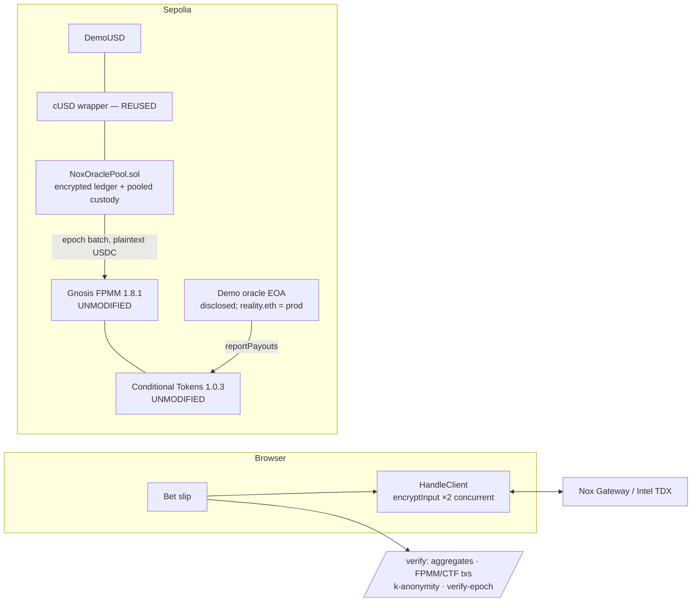

# Architecture — NoxOracle

## Stack

Next.js 14 · wagmi/viem · `@iexec-nox/handle` `0.1.0-beta.13` · Solidity `0.8.35` + Hardhat ·
`nox-confidential-contracts` 0.2.2 / `nox-protocol-contracts` 0.2.4 ·
**`@gnosis.pm/conditional-tokens-contracts` 1.0.3** + **`@gnosis.pm/conditional-tokens-market-makers`
1.8.1** (deployed unmodified from npm build artifacts; CI hash-checks the on-chain bytecode) · Tailwind
· Vercel.

## System diagram

## `NoxOraclePool.sol` — the only novel contract

State machine per epoch: `OPEN → AWAITING_DECRYPT → AWAITING_UNWRAP → EXECUTED → SETTLED` (+ `REFUNDING`).

- **`commitBet(hYes,pYes,hNo,pNo)`** — `fromExternal` both handles; accumulate the per-user ledger
  (`stakeYes/stakeNo`, `allowThis` + `addViewer(user)`), the epoch aggregates (`sumYes/sumNo`), and the
  confidential cross-epoch netting; pull the total into pooled custody via **operator-pull**
  (`allowThis(total)` → `confidentialTransferFrom(user, pool, total)`). Direction never plaintext.
- **`closeEpoch(force)`** — after the window; reverts below `K_MIN=3` (sub-k epochs never reveal;
  `force` stages the epoch-#0 exhibit). `allowPublicDecryption(sumYes)` + `(sumNo)` — the ONLY handles
  ever made public (I2).
- **`executeEpoch()`** — burns the pool's OWN pooled cUSD for the epoch total via the internal-handle
  `unwrap(euint256)` (all-or-nothing). The returned burn handle is publicly decryptable.
- **`finalizeEpoch(proof, plainYes, plainNo, minYes, minNo)`** — `finalizeUnwrap` releases exactly the
  burnt USDC; requires `plainYes+plainNo == released` (the hard spend bound, I3); then real
  `fpmm.buy(plainYes, YES, minYes)` + `buy(plainNo, NO, minNo)` with slippage guards. Pool holds all
  outcome tokens (ERC-1155 sink).
- **`settle()`** — after `payoutDenominator>0`: `redeemPositions` → USDC pot; fix the PUBLIC rate
  `(pot, winningPool)`; wrap the pot back to cUSD.
- **`claim(epoch)`** — `payout = stakeWin × rateNum / rateDen` (encrypted × trivially-encrypted public
  scalar); paid as sealed cUSD; `addViewer(user)` on the payout.
- **`refundEpoch(epoch)`** — escape hatch if the keeper/market stalls pre-execution (pool still holds
  cUSD): return each staker's full contribution (rate = 1), same machinery.
- **`kAnonymitySatisfied(epoch)`** — capability demo: `publicDecrypt(le(K_MIN, count))` as an `ebool`.

Two-layer trust model for execute/finalize, admin-minimality (pool is sole admin; users are
viewer-only), and residual risks: see [`SPEC.md`](SPEC.md).

## Why the pool uses the internal-handle `unwrap`

The pool already computes and controls the encrypted epoch total, so it unwraps with `allowThis(total)`
+ `unwrap(pool, pool, total)` — no keeper-re-encrypted external input, no owner/app-binding gymnastics.
The burn is bounded by the pool's real balance (can't spend what it doesn't hold), and `finalizeUnwrap`
releases exactly the burnt amount. (The spec hedged this overload might not exist; it does — see
`feedback.md` #1.)

## Local testing without a TEE (`MockNoxCompute`)

The Nox library hardcodes a NoxCompute address for chainId 31337. `test/helpers/market.js` installs a
transparent `MockNoxCompute` there via `hardhat_setCode`, so the **real** cUSD wrapper + **real**
NoxOraclePool + **real** Gnosis CTF/FPMM run end-to-end on local Hardhat with handles carrying
plaintext. This lets us assert economic correctness AND structural invariants (I2's public-decryption
log) locally — the "who can decrypt" security property is proven against the REAL NoxCompute on Sepolia
(shared with the green NoxSend cycle). The mock is never deployed to any live network.

## Deployment-of-record + hash-check (I5)

The Gnosis artifacts ship fully-linked 0.5.10 bytecode (no library placeholders), so deployment is a
plain `ContractFactory(abi, bytecode)`. `scripts/check_artifacts.mjs` hashes on-chain runtime vs the
package `deployedBytecode` — CTF instance directly, FPMM via `factory.implementationMaster()` (instances
are EIP-1167 proxies). Proven in `test/Artifacts.test.js`.

## Reuse & tiers

Reuses the live NoxSend `DemoUSD` (`0x486c…735C`) + cUSD (`0x82C2…8991`) — not redeployed. **Tier A**
(shipped): dual-handle core, aggregate-only reveal, on-chain k-gate, cross-epoch netting, scalar-rate
claims, verify-epoch, `@noxoracle/confidential-ctf`. **Tier B/C** (roadmap, README-labeled): reality.eth
oracle, N-outcome markets, confidential leaderboard/LMSR.
